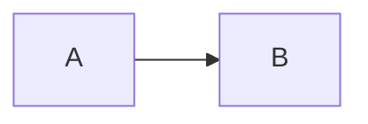

# Mkdocs Guide

## Templates

- [Lowhanging Fruite tutorial](https://lowhangingfruit.gitlab.io/mkdocstemplate/maintainer-info/introduction/)
- [codeinside Tutorial](https://www.codeinsideout.com/blog/site-setup/mkdocs-plugins/#mermaid)
- [Gnu Linux MkDocs](https://www.javieranto.com/kb/GNU-Linux/Software/mkDocs/)

## Minimal Start
### Mermaid

???+ note "FULL Picture"
     ```mermaid
     graph LR
         A --> B
     ```


## Plugins

- [mkdocs-literate-nav](https://oprypin.github.io/mkdocs-literate-nav/index.html)
- [awesome pages](https://morioh.com/p/5419588297f4)

## Items

### Diagrams

- https://lowhangingfruit.gitlab.io/mkdocstemplate/maintainer-info/mermaid/

### Navigations

- https://squidfunk.github.io/mkdocs-material/setup/setting-up-navigation/

### Tables

Tables

<table markdown="1"><tr>
<td>To get this navigation,</td>
<td>create the file <b>SUMMARY.md</b>:</td>
<td>(old YAML equivalent:)</td>
</tr><tr><td>

* [Frob](#index.md)
* [Baz](#baz.md)
* Borgs
    * [Bar](#borgs/bar.md)
    * [Foo](#borgs/foo.md)

</td><td>

```markdown
* [Frob](index.md)
* [Baz](baz.md)
* Borgs
    * [Bar](borgs/bar.md)
    * [Foo](borgs/foo.md)
```

</td><td>

```yaml
nav:
  - Frob: index.md
  - Baz: baz.md
  - Borgs:
    - Bar: borgs/bar.md
    - Foo: borgs/foo.md
```

</td></tr></table>

### Test Admonitions

!!! todo "mkdocs-guide"
    content

### Test Mermaid Graph



### Test Tabbed Content

=== "TAB 1"
    - list
    - with
    - items

=== "TAB B"
    > some par