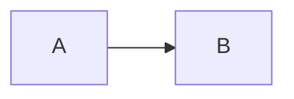

# Mkdocs Guide

## Minimal Start

### Test Admonitions

!!! todo "mkdocs-guide"
    content

### Test Mermaid Graph

### Test Tabbed Content

=== "TAB 1"
    - list
    - with
    - items

=== "TAB B"
    > some par